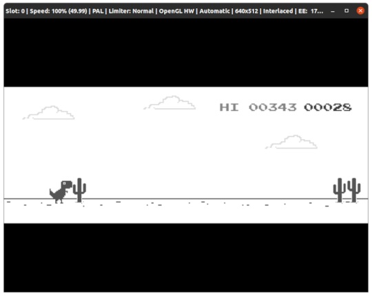

# T-Rex-PS2

A remake of Google Chrome's iconic offline T-Rex game for the PlayStation 2.

<details>
  <summary>Preview running on PCSX2</summary>
  
</details>

## Description

It is not an integral copy of the original game but it works well as a simple demo that runs on our ol' reliable PS2. While the original game was also written in JS, this was rewritten from scratch to be run using [AthenaEnv](https://github.com/DanielSant0s/AthenaEnv). 

## Compiling

AthenaEnv uses [Duktape](https://duktape.org/) underneath which means there's no out-of-the-box support for modern `ES6` syntax and features. We can however just use [Webpack](https://webpack.js.org/) and [Babel](https://babeljs.io/) to compile and transpile our code to `ES5` like we would for any other environments. Duktape doesn't implement an event loop either so don't expect to see any `setTimeout` or `requestAnimationFrame` here.

To compile, just install the required dependencies and run webpack:
```bash
npm install
npm run dev  # Run webpack in development mode (npx webpack --config webpack.dev.js)
npm run prod # Run webpack in production mode (npx webpack --config webpack.prod.js)
```

**Notes:** As default it builds for PAL systems with interlaced video output and VSync enabled but you can play around with the constants on the `.env` file before running webpack if you want to have some fun. The `dino.elf` file in the `bin` folder is actually `athena_pkd.elf` so you can update that if a new version ever comes out - hopefully it doesn't break anything. 

## Playing
If you want to test this on an emulator, [PCSX2](https://pcsx2.net/) is recommended. Just install it and enable the "Host filesystem" option. If you want to test this on actual hardware, you'll have to get a memory card with FMCB and uLaunchELF (or similar) and a USB drive. In either case, just copy the entire `bin` folder and run the `dino.elf` file. The game controls as follows: 

- Start - Pause
- Cross - Jump
- Down arrow - Crawl

## License
Distributed under GNU GPL-3.0 License. 
